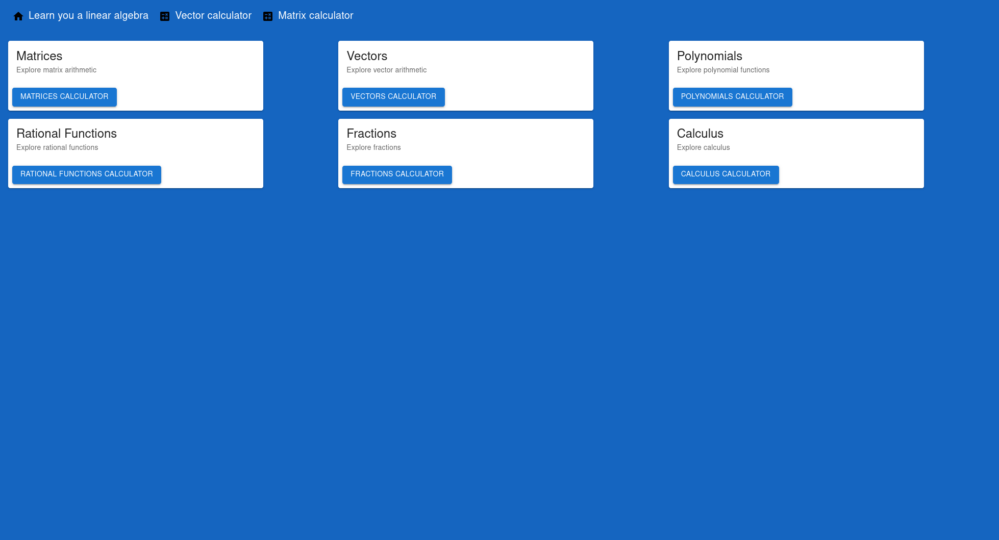
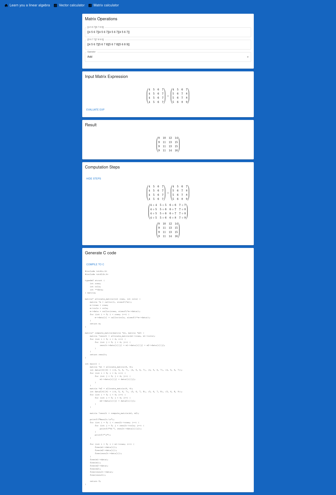

# lalg-learn
`lalg-learn` is a web app consisting of a compiler that takes a linear algebra expression and gives the user the power to see the C code representation of the expression. That is, the compiler generates C linear algebra code from a high level linear algebra expression. It also consists of an interpreter that evaluates the same kind of expression.

These systems allow the user to evaluate matrix and vector arithmetic.

The app shows the computational steps associated with the evaluation of each expression :-)

# features
- matrix and vector add and subtraction calculators
- a compiler that generates C code from a linear algebra language
- copy and download generated code

